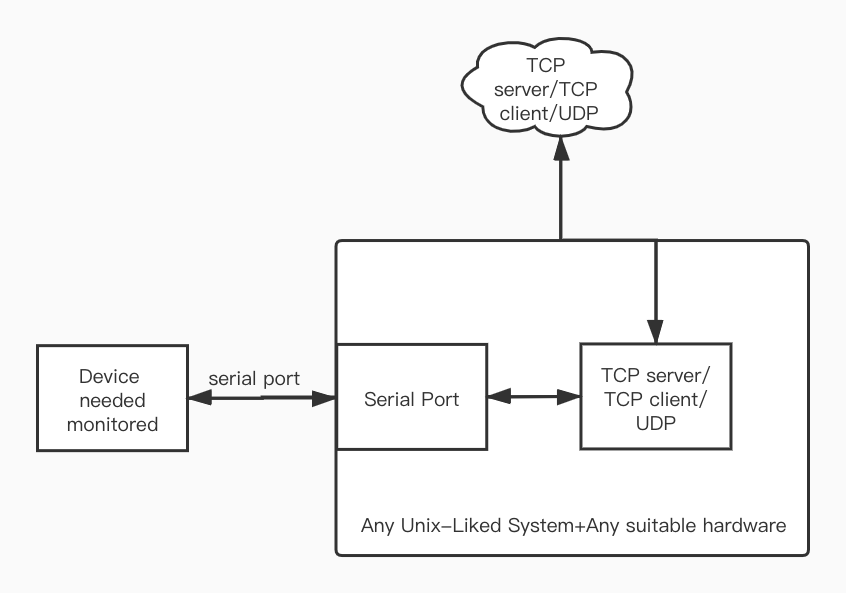
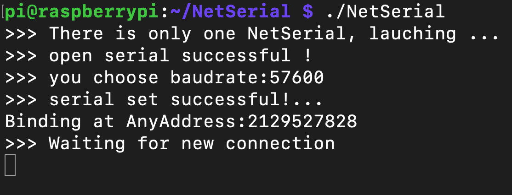
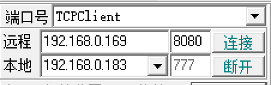
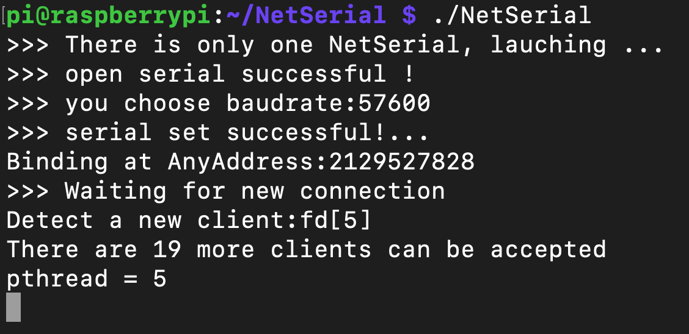
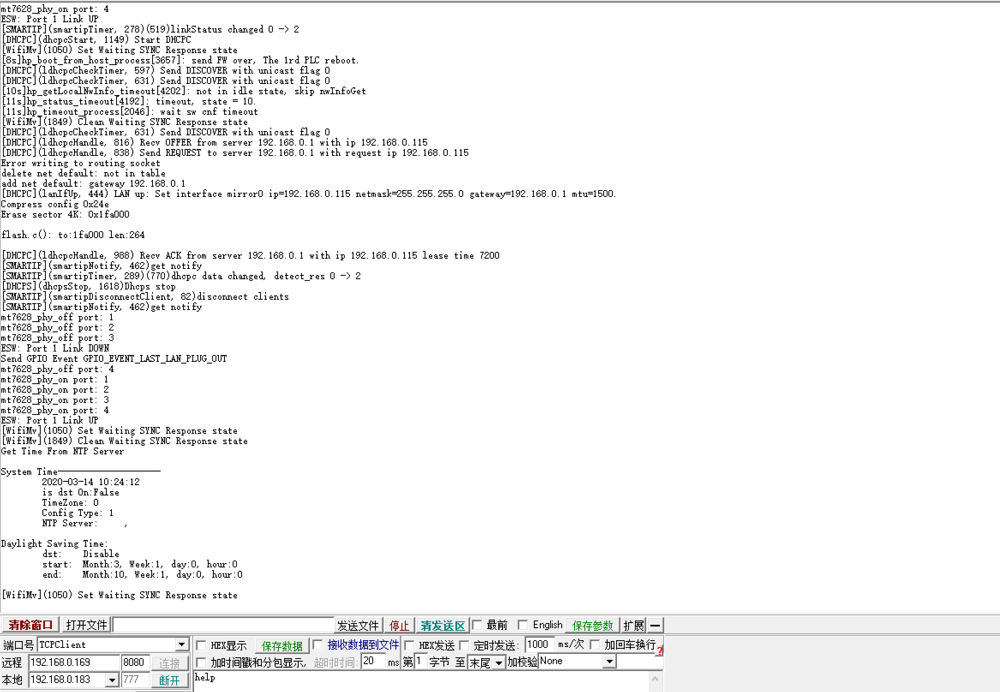
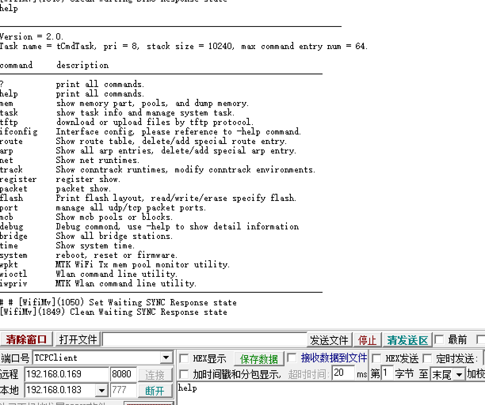

# NetSerial
应用层实现的一套串口透传方案
## 前言
大三时做的一个商业化项目，当时是结合MTK7688+Openwrt完成的一套透传方案.当然，由于是一套应用层的软件，只要能编译通过，理论上可以运行在任何类Unix的操作系统上.现在稍微调整了一些代码结构后开源(虽然看起来仍然很挫...)，用以纪念那段时光

## NetSerial是什么
NetSerial是用来帮助我们在应用层建立一个串口与网络的通道，使得从串口读到的数据，可以封装成TCP/UDP的数据流往特定的网络地址传送，或者将从特定的网络地址获取到的数据，传给串口，完成串口与网络的交互通信.从而达到定时定点进行监控或者管理某些串口的目的

## 开发状态
到目前为止，功能已经基本满足日常工作需求，暂时没有继续开发与完善的计划

## 架构


## 使用示例
当年是在MT7688+Openwrt上完成的这套软件，但目前身边并没有相同的硬件，也没有了交叉编译的环境(mips-gcc)，所以以下所有的使用范例全部运行在一块安装了树莓派官方操作系统的树莓派3B+上

### 1.作为TCP Server运行
配置NetSerial.conf, 配置文件需要与二进制执行文件处于同一文件夹下
```
[NetWork]
#要以客户端还是服务端工作 server/client
mode=server
#如果模式选择了服务端，那么该端口即为服务端绑定的端口，如果选择了客户端，那么该端口即为指定server的端口
port=8080
```
启动NetSerial
```
./NetSerial
```
此时，一个可以和串口实时通信的服务端就建立完成了


为了方便演示，我们在与树莓派处于同一内网环境下的另一台设备上，打开一个TCP Client，并连接到这个位于树莓派上的Server


图中远程的IP地址填写树莓派的IP地址，端口号填写配置文件中的端口号，本地的IP则应当选择与树莓派同一网段的IP，否则可能连接不上
点击连接后，可以看到Server已经检测到了连接.


我们给串口上个电，让串口能够输出一点东西


可以看到，我们的TCP Client已经收到了来自串口的消息。
回复一个Help，看看能否收到来自串口的消息


交互成功

### 2.作为TCP Client运行
配置NetSerial.conf
```
[NetWork]
#要以客户端还是服务端工作 server/client
mode=client
#如果模式选择了服务端，那么该端口即为服务端绑定的端口，如果选择了客户端，那么该端口即为指定server的端口
port=8080
#选择通信协议 tcp/udp
protocol=tcp
#当程序工作在客户端模式下,我们要连接到哪个IP(支持填写域名)
IP=192.168.0.183
```
配置完成后，在另一台设备上开好一个TCP Server，这台设备的IP地址应与配置中IP一致
img6

启动NetSerial
```
./NetSerial
```
可以看到，NetSerial已经连上了 TCP Server，交互通信部分不再演示

### 3.作为UDP Sender/Reciever运行
我们知道，UDP协议与TCP协议不同，UDP是无连接的，因此准确地说，在UDP的通信中其实没有Server/Client，只有Sender与Reciever的区别.为了便于理解，我把在Unix Socket编程中需要执行bind操作的一方叫做server，另一边叫做client，其余的操作，则与TCP那边一致，不再赘述.

## 一些高级配置的解释
```
[NetWork]
#客户端模式下第二连接的IP
bk_IP=192.168.0.223
#客户端模式下第二连接的端口
bk_port=8080
#客户端模式下第二连接的协议
bk_protocol=udp
#超时时间(秒)
timout=300
#心跳间隔(秒),设置为0则没有心跳
heartbeattime=30
#心跳包内容,长度小于64位
heartbeatbuf= ***HEARTBEAT***
#客户端模式下如果断开了,多长时间后重连时间(秒)
reconnecttime=10
[Data]
#从串口最多收到多少数据，就把他们组在一起发送出去
packetlength=1024
#最长多久时间内没有收到串口来的消息，就把已经收到的消息发送出去,单位毫秒
packettime=100
```
### 1.客户端模式下的第二链接
客户端模式下，在第一连接失效或者服务器主动断开连接时，支持连接到第二连接，或者备份服务器，如果不需要，配置成一样即可
### 2.客户端模式下的超时与心跳
UDP客户端模式下存在超时机制，如果设定时间内服务器没有消息传过来则认为服务器已经失效，断开此链接，默认300秒
TCP与UDP客户端下都可以定义心跳包，用以维持连接
### 3.packetlength与packettime
为了节约网络效率而定义的两组值. 由于串口的特性，如果每读到一次数据就发一个包出去，势必降低了网络效率，尤其在设计之初，是在MTK的芯片方案上做编程(你懂的)，为了降低可能的丢包率，结合 select与epoll机制设计了这两个值.
